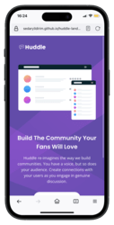
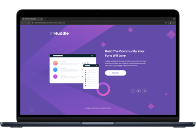

 

    
  </a>
   
   

[![Contributors][contributors-shield]][contributors-url]
[![Forks][forks-shield]][forks-url]
[![Stargazers][stars-shield]][stars-url]
[![MIT License][license-shield]][license-url]

<h3 align="center">Frontend Mentor - Huddle Landing Page</h3>

This is a solution to the [Huddle Landing Page challenge on Frontend Mentor](https://www.frontendmentor.io/challenges/huddle-landing-page-with-a-single-introductory-section-B_2Wvxgi0/hub).

  
   
    <a href="https://sedaryildirim.github.io/huddle-landing-page-main /">View Site</a>
    ·
    <a href="https://github.com/sedaryildirim/huddle-landing-page-main /issues">Report Bug</a>
    ·
    <a href="https://github.com/sedaryildirim/huddle-landing-page-main /issues">Request Feature</a>
  

## Screenshot

## Links

- Solution URL: [Add solution URL here](https://github.com/sedaryildirim/huddle-landing-page-main )
- Live Site URL: [Add live site URL here](https://sedaryildirim.github.io/huddle-landing-page-main /)

## Built with

- HTML
- CSS
- Flexbox

## Useful resources

- [Mockup Generator](https://mockuphone.com/) - Creating mockups for your project

## Author

- Github - [Sedar Yildirim](https://github.com/sedaryildirim)
- Frontend Mentor - [@sedaryildirim](https://www.frontendmentor.io/profile/sedaryildirim)

<!-- MARKDOWN LINKS & IMAGES -->
<!-- https://www.markdownguide.org/basic-syntax/#reference-style-links -->
[contributors-shield]: https://img.shields.io/github/contributors/sedaryildirim/huddle-landing-page-main .svg?style=for-the-badge
[contributors-url]: https://github.com/sedaryildirim/huddle-landing-page-main /graphs/contributors
[forks-shield]: https://img.shields.io/github/forks/sedaryildirim/huddle-landing-page-main .svg?style=for-the-badge
[forks-url]: https://github.com/sedaryildirim/huddle-landing-page-main /network/members
[stars-shield]: https://img.shields.io/github/stars/sedaryildirim/huddle-landing-page-main .svg?style=for-the-badge
[stars-url]: https://github.com/sedaryildirim/huddle-landing-page-main /stargazers
[license-shield]: https://img.shields.io/github/license/sedaryildirim/huddle-landing-page-main .svg?style=for-the-badge
[license-url]: https://github.com/sedaryildirim/huddle-landing-page-main /blob/main/LICENSE.txt
[product-screenshot]: imgs/screenshot.png
